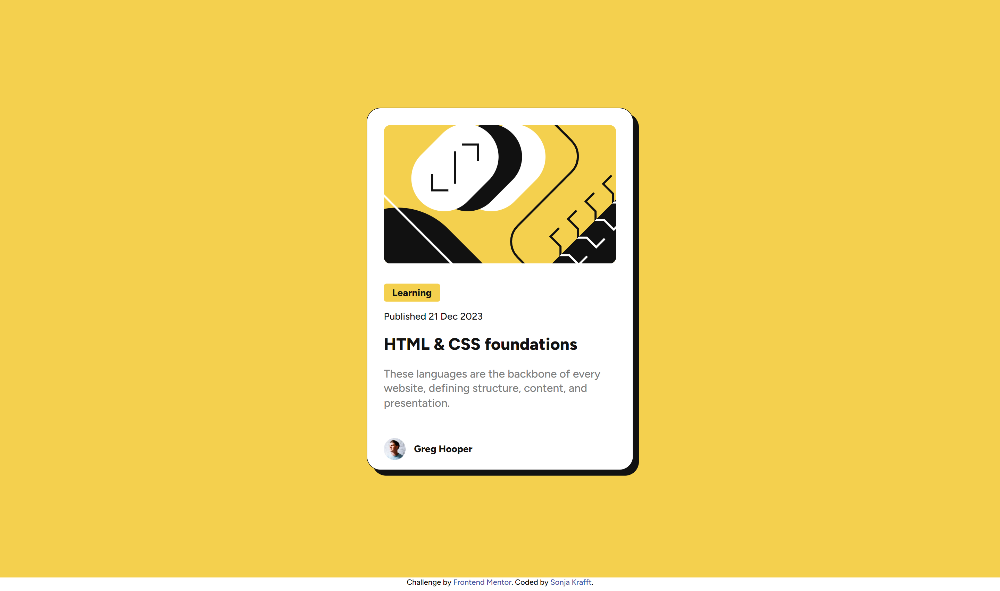

# Frontend Mentor - Blog preview card solution

This is a solution to the [Blog preview card challenge on Frontend Mentor](https://www.frontendmentor.io/challenges/blog-preview-card-ckPaj01IcS). Frontend Mentor challenges help you improve your coding skills by building realistic projects. 

## Table of contents

- [Overview](#overview)
  - [The challenge](#the-challenge)
  - [Screenshot](#screenshot)
- [My process](#my-process)
  - [Built with](#built-with)
  - [What I learned](#what-i-learned)
- [Author](#author)

## Overview

### The challenge

Users should be able to:

- See hover and focus states for all interactive elements on the page

### Screenshot

## My process

### Built with

- HTML and SCSS
- Mobile-first workflow
- Webstorm with pre-built server and File Watcher with SCSS for building CSS

### What I learned

- Box-Shadow
`
box-shadow: left-right up-down transition color
`
- Colored Box fit Text
`
display: inline-block; //makes background color fit text
`
- Make Image fit
`object-fit: cover; width: 100%;
`

## Author

- Github - [Sonja Krafft](https://www.github.com/sonmikrafft)
- Frontend Mentor - [@sonmikrafft](https://www.frontendmentor.io/profile/sonmikrafft)

